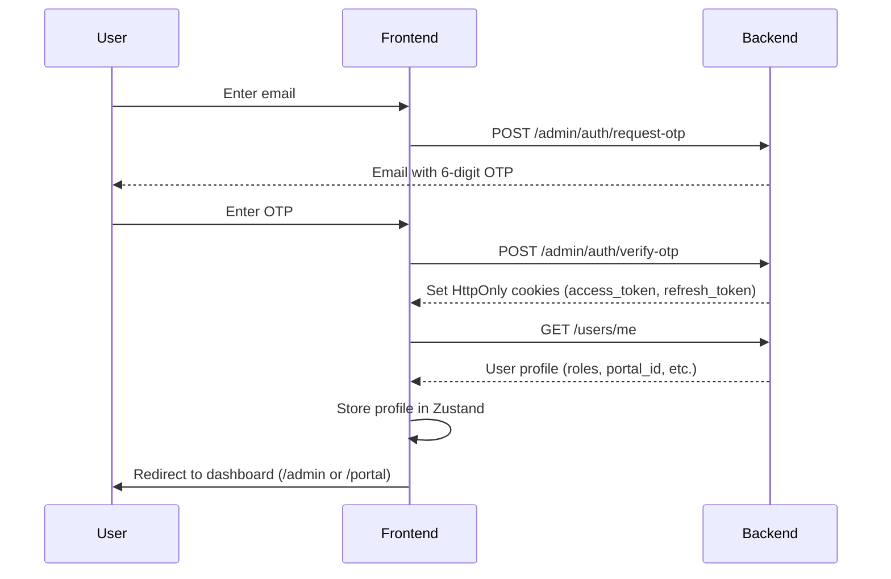

# ASP eSign Gateway Frontend

A modern, type-safe, multi-tenant frontend for the ASP eSign Gateway Service. Built with **Next.js 16** (App Router), **TypeScript**, **React Query**, and **Shadcn UI**.

---

## 📚 Documentation

- [**System Architecture**](./docs/architecture.md) - Detailed breakdown of the system's design, auth flow, and state management.
- [**Development Guidelines**](./docs/DEVELOPMENT.md) - Coding standards and best practices.
- [**Cookie Auth Setup**](./docs/COOKIE_AUTH_SETUP.md) - Deep dive into the HttpOnly cookie authentication.

---

## 🚀 Dev Quickstart

### Prerequisites

- **Bun** (v1.0+) - Fast JavaScript runtime and package manager
- Access to a running instance of the **eSign API** (FastAPI Backend)

### Setup

1.  **Install Dependencies**

    ```bash
    bun install
    ```

2.  **Environment Setup**
    Copy the example environment file and configure the backend URL:

    ```bash
    cp .env.example .env.local
    ```

    **Configuration:**

    ```env
    # .env.local

    # URL of the FastAPI backend — server-side ONLY (no NEXT_PUBLIC_ prefix).
    # The browser never talks to this URL directly; all requests go through
    # the Next.js API proxy at /api/* which forwards them here.
    BACKEND_URL="http://localhost:8000"
    ```

    > **Important:**
    >
    > - `BACKEND_URL` is the **only** required environment variable.
    > - It is **never** embedded in the client bundle — the real backend IP stays server-side.
    > - No trailing slash in the URL.
    > - When using a dev tunnel set this to the tunnel HTTPS URL (e.g. `https://mdrr740x-8000.inc1.devtunnels.ms`).

3.  **Run Development Server**

    ```bash
    bun dev
    ```

    Open [http://localhost:3000](http://localhost:3000) in your browser.

4.  **Linting & Formatting**
    To ensure your code meets the project's strict standards:
    ```bash
    bun run lint        # Check for lint errors
    bun run lint:fix    # Check and auto-fix lint errors + import sorting
    bun run format      # Format all files with Prettier
    ```

---

## 📂 Project Structure

For a detailed explanation of the directory structure and architectural decisions, see [**System Architecture**](./docs/architecture.md).

We use **Next.js 16 App Router** with **Route Groups** to strictly separate authentication contexts and organize features.

```text
src/
├── app/
│   ├── layout.tsx              # Root Layout (Fonts, ReactQuery, Toast)
│   ├── page.tsx                # Root Homepage
│   ├── error.tsx               # Global Error Boundary
│   │
│   ├── (auth)/                 # Public Authentication Routes
│   │   ├── layout.tsx          # Auth-specific Layout
│   │   ├── login/              # /login - OTP-based Login Page
│   │   └── _components/
│   │       └── login-form.tsx  # Login/OTP Form Component
│   │
│   ├── (admin)/                # Gateway Operator (Super Admin) Context
│   │   └── admin/              # URL Prefix: /admin
│   │       ├── page.tsx        # /admin - Admin Dashboard/Landing
│   │       ├── portals/        # /admin/portals - Manage Portals
│   │       │   ├── page.tsx
│   │       │   └── [portalId]/
│   │       │       └── page.tsx
│   │       ├── users/          # /admin/users - Manage Users
│   │       │   ├── page.tsx
│   │       │   └── [userId]/
│   │       │       └── page.tsx
│   │       └── _components/    # Admin-only Components
│   │           ├── onboard-portal-dialog.tsx
│   │           ├── portal-list.tsx
│   │           ├── user-actions-menu.tsx
│   │           ├── user-table.tsx
│   │           └── dashboard/
│   │
│   └── (portal)/               # Department Manager (Portal Admin) Context
│       ├── layout.tsx          # Portal Layout (Header/Navigation)
│       └── portal/             # URL Prefix: /portal
│           ├── page.tsx        # /portal - Portal Dashboard
│           ├── api-keys/       # /portal/api-keys - API Key Management
│           │   └── page.tsx
│           ├── users/          # /portal/users - Portal User Management
│           │   └── page.tsx
│           └── _components/    # Portal-only Components
│               ├── add-portal-user-dialog.tsx
│               ├── api-key-list.tsx
│               ├── generate-key-dialog.tsx
│               ├── metrics-card.tsx
│               ├── portal-user-table.tsx
│               └── dashboard/
│
├── components/
│   └── ui/                     # Shadcn UI Components
│       ├── button.tsx
│       ├── card.tsx
│       ├── form.tsx
│       ├── input.tsx
│       ├── input-otp.tsx
│       ├── label.tsx
│       ├── separator.tsx
│       ├── sheet.tsx
│       ├── sidebar.tsx
│       ├── skeleton.tsx
│       ├── sonner.tsx
│       └── tooltip.tsx
│
├── lib/
│   ├── api/                    # API Layer
│   │   ├── client.ts           # Axios Instance + Interceptors
│   │   ├── auth.ts             # Auth API Endpoints
│   │   └── types.ts            # API Response Types
│   ├── schemas/                # Zod Validation Schemas
│   │   └── auth.ts
│   ├── stores/                 # Zustand State Management
│   │   └── auth-store.ts       # User Profile Store
│   ├── errors.ts               # Custom Error Classes
│   └── utils.ts                # Utility Functions
│
└── providers/
    └── query-provider.tsx      # React Query + Global Error Handler
```

### Core

- **Next.js 16.1** - React framework with App Router
- **React 19** - UI library
- **TypeScript 5** - Type safety
- **Bun** - Runtime & package manager

### State & Data

- **React Query (TanStack Query v5)** - Server state management
- **Zustand v5** - Client state management
- **Zod v4** - Schema validation
- **React Hook Form v7** - Form management

### UI & Styling

- **Shadcn UI** (`new-york` style) - Component primitives (Radix UI + Tailwind)
- **Tailwind CSS 4** - Utility-first CSS
- **Lucide React** - Primary icon library
- **React Icons** - Supplementary icon sets
- **Sonner** - Toast notifications
- **next-themes** - Dark/light mode support

### Utilities

- **date-fns** - Date formatting/manipulation
- **xlsx** - Excel export for data tables
- **clsx + tailwind-merge** - Conditional class merging

### HTTP & API

- **Axios** - HTTP client with interceptors (401 auto-refresh)
- **Next.js API Route Proxy** - `src/app/api/[...path]/route.ts` forwards browser requests to `BACKEND_URL` server-side
- **HttpOnly Cookies** - Secure authentication (no tokens in JS)

### Dev Tools

- **ESLint 9** - Linting (with Prettier integration)
- **Prettier** - Code formatting
- **TypeScript Strict Mode** - Maximum type safety
- **simple-import-sort** - Auto-sort imports
- **unused-imports** - Remove unused imports
- **lint-staged** - Pre-commit lint hook

---

## 🔐 Authentication Flow

### OTP-Based Login (HttpOnly Cookies)



### Token Refresh (Automatic)

When any API request returns `401 Unauthorized`:

1. Axios interceptor catches the error
2. Calls `POST /admin/auth/refresh` (sends `refresh_token` cookie)
3. Backend validates & sets new `access_token` cookie
4. Retries original request automatically
5. If refresh fails, clears auth state and redirects to `/login`

> **Note:** All of this is handled automatically by the API client. See [COOKIE_AUTH_SETUP.md](./docs/COOKIE_AUTH_SETUP.md) for details.

---

## 🐛 Debugging Authentication

In development mode, authentication debug utilities are automatically loaded. Open your browser console and use:

```javascript
// Check API configuration
authDebug.checkConfig();

// Test if cookies are being sent
await authDebug.testCookies();

// Check current authentication status
await authDebug.checkAuth();

// Test token refresh
await authDebug.testRefresh();

// Run full diagnostic
await authDebug.diagnose();
```

### Common Issues

**Cookies not being sent?**

- Check if third-party cookies are blocked in browser settings
- Verify backend URL is using HTTPS (required for `secure` cookies)
- Confirm `withCredentials: true` is set (already configured)

**401 errors after login?**

- Check Network tab → Response Headers for `Set-Cookie`
- Verify backend CORS includes your frontend URL
- Run `authDebug.diagnose()` for detailed analysis

**Token refresh failing?**

- `refresh_token` cookie may be expired (7 days default)
- Check backend logs for refresh endpoint errors
- User may need to login again

See [COOKIE_AUTH_SETUP.md](./docs/COOKIE_AUTH_SETUP.md) for comprehensive troubleshooting guide.

**Key Points:**

- Frontend **never** handles raw tokens
- All API requests use `withCredentials: true`
- Refresh logic is transparent to components

---

## ⚠️ Key Development Constraints

### 1. Authentication Strategy

- **Mechanism:** HttpOnly Cookies (Not localStorage).
- **Storage:** Tokens are stored as HttpOnly cookies by the backend. The frontend **never** handles raw tokens.
- **Flow:**
  1. User enters email → Backend sends OTP
  2. User enters OTP → Backend validates and sets `access_token` + `refresh_token` cookies

### 2. State Management Rules

- **Server State (API Data):** Use **React Query** (`useQuery`, `useMutation`). Never manually store API responses in global stores.
- **Client State (Auth/UI):** Use **Zustand** (`auth-store.ts`).
  - Stores user profile from `/users/me` (persisted in localStorage for UI state only)
  - Provides `isAuthenticated` boolean for route guards
  - Does **NOT** store tokens (handled by cookies)
- **Form State:** Use **React Hook Form** + **Zod** validation schemas.

### 3. Error Handling Architecture ("Fail Fast, Fail Loud")

We do **NOT** use `try/catch` blocks in UI components. Errors flow through a centralized pipeline:

**Flow:**

1. **API Client (`src/lib/api/client.ts`):**
   - Axios interceptor catches all HTTP errors
   - Translates status codes (400, 401, 404, etc.) into custom `AppError` subclasses
   - Throws typed errors that React Query can handle
2. **React Query (`src/providers/query-provider.tsx`):**
   - **Mutations (Writes):** `MutationCache` catches errors globally → Shows toast notification
   - **Queries (Reads):** Errors bubble to component-level error states or Error Boundaries
   - Individual mutations can suppress toast via `meta: { suppressErrorToast: true }`

3. **UI Feedback:**
   - **Success:** Mutations show success toast
   - **Errors:** Automatic error toast with message from backend
   - **Critical Failures:** Fall back to `error.tsx` Error Boundary

**Error Classes (`src/lib/errors.ts`):**

````typescript
AppError (Base)
├── BadRequestError (400)
├── UnauthorizedError (401)
├── ForbiddenError (403)
├── NotFoundError (404)
├── ConflictError (409)
├── TooManyRequestsError (429)
└── InternalServerError (500)
```ia `withCredentials: true`
  - Token refresh is handled transparently by Axios interceptor
  - On 401 errors, interceptor attempts refresh using HttpOnly `refresh_token` cookie
  - Client-side Zustand store only holds user profile (not tokens)

### 2. State Management Rules
* **Server State (Data):** Use **React Query** (`useQuery`, `useMutation`). Never store API data in global stores manually.
* **Client State (Auth/UI):** Use **Zustand** (`auth-store.ts`). Used for user profile and UI toggles only.
* **Form State:** Use **React Hook Form** + **Zod**.

### 3. Styling & UI
* **Component Library:** **Shadcn UI** - Copy/paste primitives built on Radix UI
* **CSS Framework:** **Tailwind CSS 4** with PostCSS
* **Icons:** **Lucide React**
* **Fonts:** Geist Sans & Geist Mono (Next.js optimized)
* **Toast Notifications:** Sonner (integrated in root layout)
* **Theme Support:** `next-themes` for dark mode (configured in root layout)

### 4. Routing Architecture
* **Route Groups:** All pages are organized in Route Groups for clear separation:
  - `(auth)` - Unauthenticated routes (login)
  - `(admin)` - Super admin routes (URL prefix: `/admin`)
  - `(portal)` - Portal admin routes (URL prefix: `/portal`)
* **Colocation:** Components used only within a specific context are colocated:
  - `app/(admin)/admin/_components/` - Admin-only components
  - `app/(portal)/portal/_components/` - Portal-only components
  - `app/(auth)/_components/` - Auth-only components
* **Shared Components:** Truly reusable components go in `src/components/ui/`

---

## 🧠 Core Development Philosophy

### 1. Type Safety & Validation
**We trust nothing. Validate everything.**

* **API Inputs:** Validated with **Zod schemas** before sending requests
  - Located in `src/lib/schemas/`
  - Integrated with React Hook Form via `@hookform/resolvers/zod`

* **API Outputs:** Typed via **TypeScript interfaces**
  - Located in `src/lib/api/types.ts`
  - Applied to Axios responses: `apiClient.get<UserInfo>('/users/me')`

* **No `any` types:** `tsconfig.json` has `strict: true`
  - Fix types properly, never bypass with `any` or `@ts-ignore`
  - Use `unknown` for truly dynamic data, then validate

### 2. Code Quality & Consistency
**Automated enforcement via ESLint**

* **Import Sorting:** `eslint-plugin-simple-import-sort` (auto-fixes on lint)
* **Unused Code:** `eslint-plugin-unused-imports` removes unused imports
* **Unused Variables:** Prefix with `_` if intentional (e.g., `_req`, `_error`)
* **Console Logs:** `console.log` triggers warning, use `console.error` for errors
* **Type Imports:** Enforced to use `type` keyword for imports used only as types

**Run before committing:**
```bash
bun run lint:fix  # Auto-fixes import order, removes unused imports, catches errors
bun run format    # Applies Prettier formatting
````

### 3. Developer Experience (DX) Priorities

- **Fast Feedback:** ESLint + TypeScript catch errors immediately
- **No Manual Formatting:** ESLint handles formatting (configured with Prettier rules)
- **Clean Imports:** Automatically sorted and deduplicated
- **Toast Notifications:** Global error handling via React Query shows user-friendly messages
- **Type-Safe Forms:** Zod + React Hook Form provide runtime validation and TypeScript inference

---

## 📝 Common Development Patterns

### 1. Creating a New API Endpoint

**Step 1: Define the API function** (`src/lib/api/[feature].ts`)

```typescript
import { apiClient } from "./client";

export interface Portal {
  id: string;
  name: string;
  created_at: string;
}

export const portalApi = {
  getAll: async () => {
    const response = await apiClient.get<Portal[]>("/admin/portals");
    return response.data;
  },

  create: async (data: { name: string }) => {
    const response = await apiClient.post<Portal>("/admin/portals", data);
    return response.data;
  },
};
```

**Step 2: Use in Component with React Query**

```typescript
'use client';

import { useQuery, useMutation, useQueryClient } from '@tanstack/react-query';
import { portalApi } from '@/lib/api/portal';
import { toast } from 'sonner';

export function PortalList() {
  const queryClient = useQueryClient();

  // Fetch data
  const { data: portals, isLoading } = useQuery({
    queryKey: ['portals'],
    queryFn: portalApi.getAll,
  });

  // Mutate data
  const createPortal = useMutation({
    mutationFn: portalApi.create,
    onSuccess: () => {
      toast.success('Portal created!');
      queryClient.invalidateQueries({ queryKey: ['portals'] });
    },
    // onError is handled globally by QueryProvider
  });

  if (isLoading) return <div>Loading...</div>;

  return (
    <div>
      {portals?.map(portal => <div key={portal.id}>{portal.name}</div>)}
      <button onClick={() => createPortal.mutate({ name: 'New Portal' })}>
        Create Portal
      </button>
    </div>
  );
}
```

### 2. Creating a Form with Validation

**Step 1: Define Zod Schema** (`src/lib/schemas/[feature].ts`)

```typescript
import { z } from "zod";

export const createPortalSchema = z.object({
  name: z
    .string()
    .min(3, "Name must be at least 3 characters")
    .max(50, "Name must be less than 50 characters"),
  description: z.string().optional(),
});

export type CreatePortalForm = z.infer<typeof createPortalSchema>;
```

**Step 2: Use in Component**

```typescript
'use client';

import { useForm } from 'react-hook-form';
import { zodResolver } from '@hookform/resolvers/zod';
import { createPortalSchema, type CreatePortalForm } from '@/lib/schemas/portal';

export function CreatePortalForm() {
  const form = useForm<CreatePortalForm>({
    resolver: zodResolver(createPortalSchema),
    defaultValues: {
      name: '',
      description: '',
    },
  });

  const onSubmit = (data: CreatePortalForm) => {
    // Data is validated, TypeScript knows the shape
    console.log(data);
  };

  return (
    <form onSubmit={form.handleSubmit(onSubmit)}>
      {/* Use Shadcn Form components */}
    </form>
  );
}
```

### 3. Accessing User State

```typescript
'use client';

import { useAuthStore } from '@/lib/stores/auth-store';
import { ROLES } from '@/lib/auth/roles';

export function UserProfile() {
  const user = useAuthStore((s) => s.user);
  const isAuthenticated = useAuthStore((s) => s.isAuthenticated);

  if (!isAuthenticated) {
    return <div>Please log in</div>;
  }

  // Use ROLES constants — never hardcode raw strings
  const isAdmin = user?.roles.some((r) => r.name === ROLES.SUPER_ADMIN);
  const isPortalAdmin = user?.roles.some((r) => r.name === ROLES.PORTAL_ADMIN);

  return (
    <div>
      <p>Email: {user.email}</p>
      {isAdmin && <AdminPanel />}
    </div>
  );
}
```

### 4. Suppressing Error Toasts (When Needed)

```typescript
const mutation = useMutation({
  mutationFn: someApi.create,
  meta: {
    suppressErrorToast: true, // Won't show global toast
  },
  onError: (error) => {
    // Handle error manually in component
    console.error("Custom error handling:", error);
  },
});
```

---

## 🚨 Common Pitfalls & Solutions

### ❌ DON'T: Store API data in Zustand

```typescript
// BAD - Don't do this
const useDataStore = create((set) => ({
  portals: [],
  fetchPortals: async () => {
    const data = await portalApi.getAll();
    set({ portals: data });
  },
}));
```

### ✅ DO: Use React Query

```typescript
// GOOD - Use React Query
const { data: portals } = useQuery({
  queryKey: ["portals"],
  queryFn: portalApi.getAll,
});
```

---

### ❌ DON'T: Use try/catch in components

```typescript
// BAD - Error handling is done globally
const handleSubmit = async () => {
  try {
    await createPortal(data);
    toast.success("Success!");
  } catch (error) {
    toast.error("Failed!");
  }
};
```

### ✅ DO: Let React Query handle errors

```typescript
// GOOD - Errors show toast automatically
const mutation = useMutation({
  mutationFn: portalApi.create,
  onSuccess: () => toast.success("Success!"),
  // onError handled by QueryProvider
});
```

---

### ❌ DON'T: Access tokens directly

```typescript
// BAD - Never do this
localStorage.getItem("access_token");
```

### ✅ DO: Trust the cookie system

```typescript
// GOOD - Cookies are sent automatically
const response = await apiClient.get("/protected-route");
// withCredentials: true handles everything
```

---

## 🛠️ Troubleshooting

### Issue: "401 Unauthorized" on every request

**Solution:** Ensure backend CORS allows credentials:

```python
# Backend (FastAPI)
app.add_middleware(
    CORSMiddleware,
    allow_origins=["http://localhost:3000"],
    allow_credentials=True,  # ← Required for cookies
    allow_methods=["*"],
    allow_headers=["*"],
)
```

### Issue: Types not updating after schema change

**Solution:** Restart TypeScript server

- VS Code: `Cmd/Ctrl + Shift + P` → "TypeScript: Restart TS Server"

### Issue: ESLint not auto-fixing

**Solution:** Run lint command manually

```bash
bun run lint
```

---

## 📚 Project Conventions

### File Naming

- **All files:** `kebab-case.tsx` / `kebab-case.ts` (e.g., `user-table.tsx`, `auth-store.ts`)
- **Routes:** kebab-case directories (e.g., `api-keys/page.tsx`, `team-members/page.tsx`)
- **Components export:** named function declaration — `export function MyComponent()`, not `const`

### Component Organization

```
_components/           # Private to parent route
  ├── feature-dialog.tsx
  └── feature-table.tsx

components/ui/         # Shared Shadcn components
  ├── button.tsx
  └── input.tsx
```

### Import Order (Auto-sorted by ESLint)

1. React/Next imports
2. External libraries
3. Internal aliases (`@/`)
4. Relative imports
5. Types

---

## 🤝 Contributing

1. Create a feature branch from `main`
2. Make your changes
3. Run `bun run lint` to ensure code quality
4. Test thoroughly (authentication, API calls, UI)
5. Submit PR with clear description

---

## 📄 License

[Your License Here]

---

**Built with ❤️ using Next.js, TypeScript, and Modern React Patterns**
