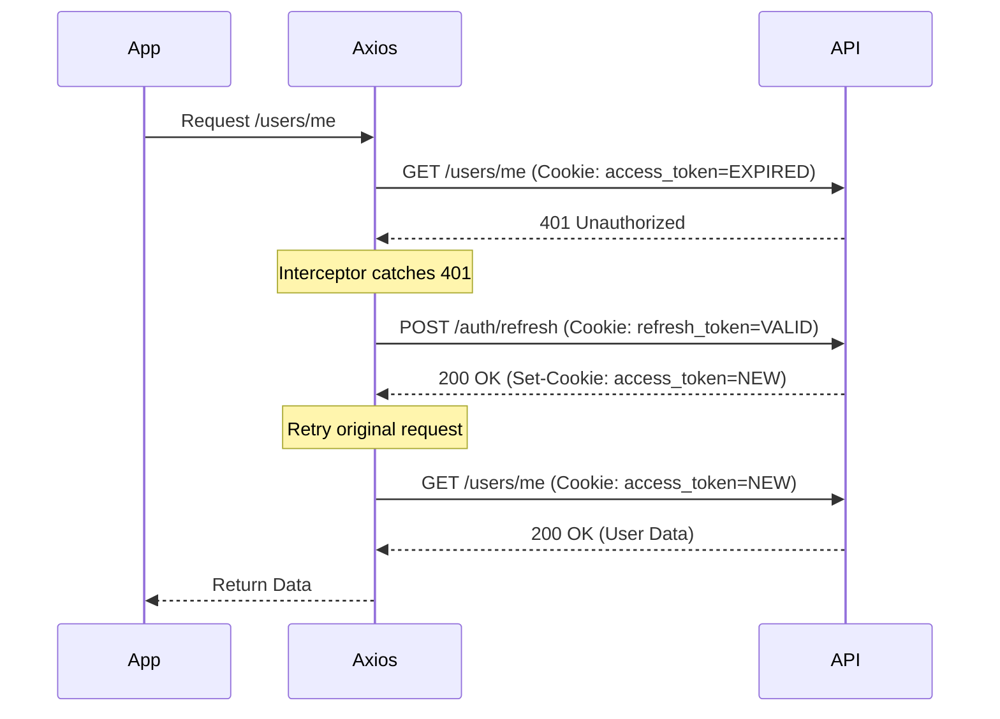

# 🍪 Cookie Authentication Setup & Debugging

This guide explains the **HttpOnly Cookie** authentication strategy used in the eSign Gateway Frontend. We do **not** store tokens in `localStorage` or `sessionStorage` for security reasons (XSS protection).

## 1. How It Works

### The Flow
1.  **Login**: User enters credentials → Backend validates & sets `access_token` and `refresh_token` cookies.
2.  **Session**: Browser automatically attaches these cookies to every subsequent request to the API domain.
3.  **Refresh**: If an `access_token` expires (401 error), the frontend automatically calls the refresh endpoint using the `refresh_token` cookie to get a new session.

### Security Features
-   **HttpOnly**: JavaScript cannot read the tokens, preventing XSS attacks from stealing sessions.
-   **Secure**: Cookies are only sent over HTTPS (in production).
-   **SameSite**: Controls when cookies are sent with cross-site requests (usually 'Lax' or 'None' depending on architecture).

## 2. Frontend Implementation

The frontend is "token-agnostic". It never sees the raw JWT strings.

### Axios Configuration (`src/lib/api/client.ts`)

We use a singleton Axios instance configured to always send credentials:

```typescript
export const apiClient = axios.create({
  baseURL: process.env.NEXT_PUBLIC_API_BASE_URL,
  withCredentials: true, // 👈 CRITICAL: Enables sending/receiving cookies
});
```

### Automatic Token Refresh (Interceptor)

We use an Axios response interceptor to handle `401 Unauthorized` errors transparently:



If the refresh fails (e.g., refresh token is also expired), the interceptor triggers a **Session Expired** event:
1.  Clears the local Zustand store (User Profile).
2.  Redirects the user to `/login`.

## 3. Debugging Guide

Authentication issues are almost always related to **Environment Configuration** or **Browser Security Policies**.

### 🛠️ Built-in Debug Tools

Open your browser console in development mode and use the `authDebug` helper:

```javascript
// 1. Check if backend URL is correct
authDebug.checkConfig();

// 2. Test if cookies are being sent/received
await authDebug.testCookies();

// 3. Force a token refresh
await authDebug.testRefresh();

// 4. Run full diagnostic suite
await authDebug.diagnose();
```

### ❌ Common Issues & Fixes

#### Issue 1: Login succeeds, but subsequent requests fail (401)
**Symptoms**: You get redirected to the dashboard, but it immediately kicks you back to login, or data doesn't load.
**Cause**: The browser is **blocking third-party cookies**.
**Fix**:
1.  **Development**: If Frontend is `localhost:3000` and Backend is `api.dev.com`, cookies are "third-party".
    -   Disable "Block Third-Party Cookies" in browser settings.
    -   OR: Use a proxy to make them same-origin.
2.  **Production**: Frontend and Backend should share a root domain (e.g., `app.esign.com` and `api.esign.com`) OR specific CORS/SameSite config is required.

#### Issue 2: "CORS error" or "Network Error" on Login
**Cause**: Backend is not configured to accept credentials from your origin.
**Fix**:
-   Backend must respond with `Access-Control-Allow-Origin: http://localhost:3000` (Exact match, NO wildcards `*`).
-   Backend must respond with `Access-Control-Allow-Credentials: true`.

#### Issue 3: Refresh Loop
**Cause**: `refresh_token` cookie is missing or invalid.
**Fix**: Clear browser cookies for the API domain and log in again.

## 4. Backend Requirements (Reference)

For this frontend setup to work, the backend (FastAPI) must be configured as follows:

```python
# FastAPI CORSMiddleware
app.add_middleware(
    CORSMiddleware,
    allow_origins=["http://localhost:3000"], // Must match frontend origin exactly
    allow_credentials=True,                  // REQUIRED
    allow_methods=["*"],
    allow_headers=["*"],
)

# Cookie Setting
response.set_cookie(
    key="access_token",
    value=token,
    httponly=True,   // REQUIRED
    samesite="lax",  // or 'none' if cross-domain
    secure=True      // True for HTTPS, False for localhost
)
```
